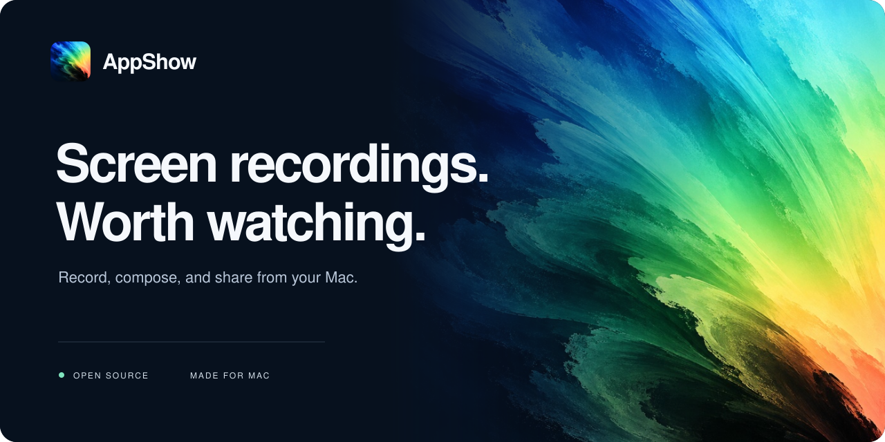
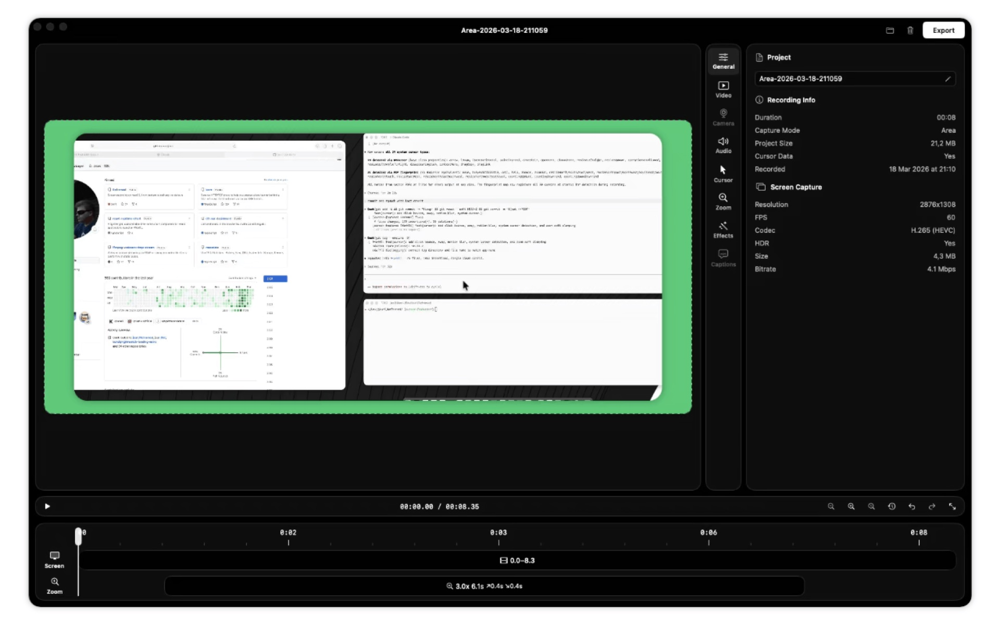

<p align="center">
  
</p>

<p align="center">
  <strong>Capture a thought. Shape the story. Share something beautiful.</strong><br />
  Screen recording, thoughtful editing, and an optional AI assistant in one native Mac app.
</p>

<p align="center">
  <a href="#get-started">Get started</a> &nbsp; · &nbsp;
  <a href="#made-for-the-details">Features</a> &nbsp; · &nbsp;
  <a href="docs/README.md">Documentation</a> &nbsp; · &nbsp;
  <a href="CONTRIBUTING.md">Contribute</a>
</p>

<p align="center"><sub>macOS 15+ &nbsp; / &nbsp; Swift 6 &nbsp; / &nbsp; Open source</sub></p>

---

## From screen to story

AppShow turns screen recordings into product demos, walkthroughs, and tutorials. Record your display, a window, a selected area, or a connected iPhone or iPad. Then bring the important moments forward with smooth zooms, a carefully placed camera, and captions that feel like part of the composition.

Your recording opens directly in the editor. Every project keeps its original media and editable settings together, so you can come back and make the next version.

| Capture | Compose | Share |
| --- | --- | --- |
| Screen, window, region, or iOS device. Add your camera, microphone, and system audio. | Cut pauses. Follow the cursor. Frame your camera. Add captions, music, and overlays. | Export MP4, MOV, or GIF, with canvas sizes and presets for your next destination. |

## Made for the details

### Motion with intention

Use cursor-follow zooms, automatic zoom detection, or your own keyframes to guide attention. Adjust cursor smoothing, click highlights, and transitions. Trim a recording into editable keep-slices, remove silence, and speed up selected sections from 1.5× to 32× without rewriting the original footage.

### A place for your voice

Start with a circular webcam overlay, expand into a focus moment, or use half- and third-width camera layouts. Clean up microphone noise and generate captions with on-device transcription. Choose an installed font, tune the colors, and keep the result editable.

### Your presentation, your composition

Set the canvas, background, padding, and corners. Layer text, images, spotlight and blur regions over the recording. Bring in music with independent volume, fades, and timing. Undo and redo as you explore.

### An assistant at the editing desk

Connect your locally installed Codex or Claude Code. Ask about the project or enable editing tools for cuts, captions, camera regions, and presentation settings. Conversations travel with the project; editing tools support labeled undo steps, with in-app confirmation for sensitive actions.

The assistant is optional and uses the selected provider's service and account. On-device transcription uses WhisperKit models downloaded separately.

<details>
  <summary><strong>A look at the editing workspace</strong></summary>
  <br />
  
  <p><sub>Interface reference from Reframed, the project AppShow builds on. AppShow adds editable cuts, an assistant panel, expanded webcam layouts, and caption styling.</sub></p>
</details>

## Get started

AppShow is in active development. Build from source today; packaged builds will appear on the [releases page](https://github.com/mattwebhub/AppShow/releases).

You need **macOS 15 or later** and **Xcode with Swift 6**. On-device transcription requires Apple silicon.

```sh
git clone https://github.com/mattwebhub/AppShow.git
cd AppShow
make dev
```

Xcode resolves the Swift packages during the build. The default configuration uses ad-hoc signing; an Apple Developer account is not required to build locally. For personal signing settings, copy `Local.xcconfig.example` to `Local.xcconfig` and follow its instructions.

Grant Screen Recording access when you want to capture. Accessibility enables global shortcuts and capture-related interactions; microphone and camera access are optional. You can open and edit projects without capture permissions.

## Built to keep working

Recordings are saved as portable `.appshow` project bundles with their source media, editing settings, and assistant conversation. Legacy `.frm` projects remain supported.

Export H.264, H.265, ProRes, or GIF. Burn captions into the video or export SRT/VTT sidecars. Set the frame rate, resolution, and aspect ratio for the place your story is going.

| Explore | |
| --- | --- |
| [Recording](docs/recording.md) | Capture modes, devices, audio, and permissions |
| [Editing](docs/editor.md) | Timelines, camera layouts, captions, and presentation |
| [Export](docs/export.md) | Formats, quality, audio, and output settings |
| [Project format](docs/project-format.md) | What travels inside a project bundle |
| [Architecture](docs/architecture/00-overview.md) | How the native app is put together |

## Build with us

Good design needs careful engineering and real feedback. Bug reports, small fixes, documentation improvements, and focused design proposals are welcome.

Read the [contribution guide](CONTRIBUTING.md), [report a bug](https://github.com/mattwebhub/AppShow/issues/new?template=bug_report.yml), or [suggest an improvement](https://github.com/mattwebhub/AppShow/issues/new?template=feature_request.yml). The [project plan](planning/STATE.md) records completed work and the manual checks still ahead.

## Credits & license

AppShow builds on [Reframed](https://github.com/jkuri/Reframed) by Jan Kuri and its contributors. Its capture and editing foundation made this project possible.

The repository retains the [MIT license](LICENSE). GIF export links [gifski](https://gif.ski), which is licensed AGPL-3.0-or-later; its [license text](AppShow/Libraries/gifski/LICENSE) is included. Distributed builds are offered with full source under AGPL-compatible terms. See the [dependency inventory](docs/architecture/04-dependencies.md) for component-level details.

<p align="center"><sub>AppShow · Made for the moments worth showing.</sub></p>
