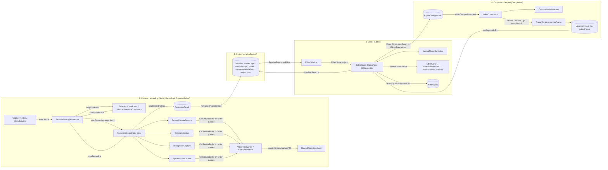

# 00 — Architecture Overview

**Scope.** Engineering-level view of the Reframed codebase as forked at `v0.14.7` (build 26, see `Config.xcconfig`). The feature-level docs (`docs/architecture.md`, `docs/recording.md`, `docs/editor.md`, `docs/export.md`, `docs/project-format.md`) describe *what* the app does; this series describes *how the code is put together* — file paths, type names, isolation domains, and concrete call chains — so that a new team can develop against it with TDD. Where the existing docs or `AGENTS.md` disagree with the code, that is called out explicitly.

Companion documents:

| File | Contents |
| --- | --- |
| `01-module-map.md` | One section per folder under `Reframed/`, dependencies between folders, cycles |
| `02-concurrency.md` | Isolation map (`@MainActor` / actor / `@unchecked Sendable`), boundary-crossing patterns, `SharedRecordingClock`, hazards |
| `03-data-flow.md` | Three end-to-end traces: area recording → `.frm`, editor property change → preview, export → MP4 |
| `04-dependencies.md` | Every SPM package and vendored library, import sites, licenses, Sparkle fork-safety |
| `05-coding-patterns.md`, `06-conventions-checklist.md` | Written separately (not part of this series); style/pattern guidance that complements the structural view here |

## What the app is

- A macOS 15+ screen recorder with a built-in timeline editor and a CoreGraphics compositor/exporter. Swift 6 strict concurrency (`SWIFT_VERSION = 6.0` in `Reframed.xcodeproj/project.pbxproj`), SwiftUI for views, AppKit for every window/panel/overlay, ScreenCaptureKit + AVFoundation for capture, AVFoundation + CoreGraphics for export.
- **One Xcode target, one Swift module.** `Reframed.xcodeproj` has a single `PBXNativeTarget` (`Reframed`, `com.apple.product-type.application`) and a single scheme (`Reframed.xcodeproj/xcshareddata/xcschemes/Reframed.xcscheme`). The folders under `Reframed/` are organisational only; there is no access-control or link-time boundary between them, and internal types are referenced freely across folders (see `01-module-map.md`).
- **Upstream ships no test target and no linter.** The fork adds `ReframedTests/` (hosted unit-test bundle, Swift Testing, `make test`) and `make lint` (`swift format lint`); see `07-testability.md` and `planning/tdd-strategy.md`. Formatting is `swift format` driven by `.swift-format` (2-space indent, 140-column lines, `OrderedImports`, `FileScopedDeclarationPrivacy`).
- ~33 k lines of Swift under `Reframed/` (`wc -l`), plus a vendored static C library (`Reframed/Libraries/gifski/`).
- Identity: bundle id `eu.jkuri.reframed` (pbxproj `PRODUCT_BUNDLE_IDENTIFIER`); `.frm` UTI `eu.jankuri.reframed.project` (`Reframed/Info.plist`); `LSUIElement = false` (Dock icon); app sandbox **off**, hardened runtime **on** (`Reframed/Reframed.entitlements`, pbxproj `ENABLE_HARDENED_RUNTIME = YES`); upstream hardcoded `DEVELOPMENT_TEAM = 5A5U3XX696`; the fork removed it and signs ad-hoc by default through `Config.xcconfig` with an optional git-ignored `Local.xcconfig` (ADR 0003).
- Fork state: git `origin` → `mattwebhub/Reframed`, `upstream` → `jkuri/Reframed`. The Sparkle appcast URL and EdDSA public key in `Reframed/Info.plist` still point at upstream (`04-dependencies.md`, "Sparkle").

## The four top-level runtime subsystems

| # | Subsystem | Owning type(s) | Folder(s) | Produces |
| --- | --- | --- | --- | --- |
| 1 | **Capture / recording** | `SessionState` (`Reframed/State/SessionState.swift`, `@MainActor @Observable`) drives the lifecycle; `RecordingCoordinator` (`Reframed/Recording/RecordingCoordinator.swift`, the only real `actor`) owns capture sources and track writers | `State/`, `Recording/`, `CaptureModes/`, `UI/` (toolbar, menu bar) | `RecordingResult` (`Reframed/Recording/RecordingResult.swift`): URLs of temp files in `/tmp/Reframed/` plus sizes/fps/quality |
| 2 | **Project bundle** | `ReframedProject` (`Reframed/Project/ReframedProject.swift`, `struct … Sendable`) and `ProjectMetadata` / `EditorStateData` (`Reframed/Project/ProjectMetadata.swift`) | `Project/` | A `<name>.frm` directory in `~/Reframed` (default `ConfigService.projectFolder`) containing media + `project.json` + `history.json` |
| 3 | **Editor** | `EditorWindow` (`Reframed/Editor/EditorWindow.swift`, AppKit window host) → `EditorState` (`Reframed/Editor/EditorState.swift`, `@MainActor @Observable`) → `SyncedPlayerController` (`Reframed/Editor/SyncedPlayerController.swift`) for playback; `VideoPreviewView`/`VideoPreviewContainer` for the live preview | `Editor/`, `UI/` | Mutations of `EditorState`, auto-saved to `project.json` every 1 s of quiet and snapshotted into `History` every 1.5 s |
| 4 | **Compositor / export** | `VideoCompositor` (`Reframed/Compositor/VideoCompositor.swift`, static enum) orchestrates; `FrameRenderer` (`Reframed/Compositor/FrameRenderer.swift`) renders each frame with CoreGraphics; `ExportSheet` (`Reframed/Compositor/ExportSheet.swift`) is the SwiftUI entry | `Compositor/`, `Utilities/` (encoding, RNNoise, click sounds, subtitles) | MP4 / MOV / GIF in `~/Movies/Reframed` (default `ConfigService.outputFolder`), optional `.srt` / `.vtt` |

Each subsystem hands a **value type** to the next: `RecordingResult` → `ReframedProject` → (`EditorState` is a reference type, but it hands the compositor an) `ExportConfiguration` (`Reframed/Compositor/ExportConfiguration.swift`, `struct … Sendable`). This is the seam a test suite should exploit: every subsystem boundary is a plain `Sendable` struct that can be constructed in a test without hardware.

### Subsystem handoffs

Two things the diagram makes visible that the feature docs do not:

1. `EditorState` is the hub of subsystems 3 and 4 — the compositor never reads `EditorState`; it only receives the frozen `ExportConfiguration` built in `EditorState.export(settings:)` (`Reframed/Editor/EditorState+Export.swift`).
2. `SessionState` never goes away while an editor is open: it keeps `editorWindows: [EditorWindow]` and stays in `.editing` until the last window closes (`SessionState.removeEditor`, `Reframed/State/SessionState+Project.swift`).

## Process and window model

Single process, single `NSApplication`. Entry point is `ReframedApp` (`Reframed/ReframedApp.swift`, `@main`), whose only scene is a `MenuBarExtra(.window)`; everything else is an AppKit window created imperatively and owned by `SessionState` or `AppDelegate`.

| Window / panel | Class | File | Level & behaviour | Owner |
| --- | --- | --- | --- | --- |
| Menu bar popover | SwiftUI `MenuBarExtra` + `MenuBarView` | `Reframed/ReframedApp.swift`, `Reframed/UI/MenuBarView.swift` | `.menuBarExtraStyle(.window)`; `MenuBarExtraAccess` exposes the `NSStatusBarButton` so `AppDelegate` can intercept left-clicks to stop a recording | `ReframedApp` |
| Floating capture toolbar | `CaptureToolbarWindow: NSPanel` | `Reframed/UI/CaptureToolbarWindow.swift` | `.borderless, .nonactivatingPanel`, `level = .screenSaver`, `canJoinAllSpaces`, `sharingType = .none` (excluded from capture), position persisted in `StateService.toolbarPosition` | `SessionState.toolbarWindow` |
| Area-selection overlays (one per display) | `SelectionOverlayWindow: NSWindow` hosting `SelectionOverlayView` (AppKit) | `Reframed/CaptureModes/CaptureArea/` | `.borderless`, `level = .screenSaver`, becomes key on mouse-move | `SelectionCoordinator.overlayWindows` |
| "Start recording" overlays for entire-screen mode (one per display) | `StartRecordingWindow: NSPanel` hosting `StartRecordingOverlayView` (SwiftUI) | `Reframed/CaptureModes/CaptureScreen/StartRecordingOverlay.swift` | `.nonactivatingPanel`, `level = .screenSaver` | `SessionState.startRecordingWindows` |
| Window-selection overlays + highlight | `WindowSelectionOverlay`, highlight reuses `RecordingBorderWindow` | `Reframed/CaptureModes/CaptureWindow/` | mouse tracking via local `NSEvent` monitor; SCWindow list refreshed every 2 s | `WindowSelectionCoordinator` |
| Recording border | `RecordingBorderWindow: NSWindow` | `Reframed/CaptureModes/Common/RecordingBorderWindow.swift` | `level = .floating`, `ignoresMouseEvents = true`, `sharingType = .none`; follows the captured window via `WindowPositionObserver` (CADisplayLink) | `SelectionCoordinator.borderWindow` |
| Webcam preview | `WebcamPreviewWindow` | `Reframed/Recording/WebcamPreviewWindow.swift` | shows the live `AVCaptureSession`; hidden while recording if `hideCameraPreviewWhileRecording` | `SessionState.webcamPreviewWindow` |
| Recording preview (live SCStream thumbnail) | `RecordingPreviewWindow` (wraps an `NSPanel`) | `Reframed/Recording/RecordingPreviewWindow.swift` | frames pushed from the capture queue via `IOSurface` at ≤ 30 Hz | `SessionState.recordingPreviewWindow` |
| iOS device preview + countdown | `DevicePreviewWindow` | `Reframed/Recording/DevicePreviewWindow.swift` | | `SessionState.devicePreviewWindow` |
| Editor (N allowed) | `EditorWindow` (NSObject owning an `NSWindow` + `NSHostingView<EditorView>`) | `Reframed/Editor/EditorWindow.swift` | min 1400×900 (`Layout.editorWindowMinWidth/Height`, `Reframed/UI/Constants.swift`); frame persisted in `StateService.editorWindowFrame`; briefly `.floating` then `.normal` | `SessionState.editorWindows` |
| Permissions | plain `NSWindow` + `PermissionsView` | `Reframed/App/AppDelegate.swift` | shown at launch if `Permissions.allPermissionsGranted == false` | `AppDelegate.permissionsWindow` |
| Settings | `SettingsView` presented from the toolbar | `Reframed/UI/SettingsView.swift`, opened in `Reframed/UI/CaptureToolbar+ModeSelection.swift` | SwiftUI sheet/popover, not a separate `NSWindow` | toolbar |

All overlay/panel windows set `sharingType = .none` (`Window.sharingType`, `Reframed/UI/Constants.swift`) **and** the recording filter excludes the app itself (`SCContentFilter(display:excludingApplications:…)` in `ScreenCaptureSession.start`), so Reframed's own UI never appears in captures.

Keyboard input has two layers (`Reframed/State/KeyboardShortcutManager.swift`): a local `NSEvent` monitor for app-focused shortcuts and a `CGEventTap` on the main run loop for global stop/pause/restart. The editor adds its own local monitor in `EditorWindow.setupKeyboardMonitor` for undo/redo/transport.

## Where state lives on disk

| Path | Written by | Contents |
| --- | --- | --- |
| `~/.reframed/reframed.json` | `ConfigService` (`Reframed/State/ConfigService.swift`) | user preferences (`ConfigData`), merged over defaults on load |
| `~/.reframed/state.json` | `StateService` (`Reframed/State/StateService.swift`) | last selection rect, window positions, editor frame |
| `~/.reframed/<whisper model folders>` | `WhisperModelManager` (`Reframed/Utilities/WhisperModelManager.swift`) | downloaded WhisperKit models |
| `~/Library/Logs/Reframed/reframed.log` (+ rotated `frame.N.log`) | `RotatingFileLogHandler` (release builds only) | swift-log output |
| `/tmp/Reframed/` | `FileManager+Reframed` (`Reframed/Recording/FileManager+Reframed.swift`) | in-flight recording and export files; cleared by `cleanupTempDir()` |
| `~/Reframed/*.frm` | `ReframedProject` | project bundles |
| `~/Movies/Reframed/` | `VideoCompositor.export` via `FileManager.defaultSaveURL` | exported videos |

## Where the code disagrees with `AGENTS.md` / `docs/`

Details and evidence are in the companion files; the headline items a new developer must not be misled by:

1. **`VideoTrackWriter` and `AudioTrackWriter` are not actors.** They are `final class … @unchecked Sendable` guarded by a private serial `DispatchQueue` (`Reframed/Recording/VideoTrackWriter.swift:6`, `AudioTrackWriter.swift:5`). `AGENTS.md`, `docs/architecture.md`, `docs/recording.md` and `CONTRIBUTING.md` all call them actors. The only `actor` in the app is `RecordingCoordinator` (plus a private `RNNoiseProgressTracker`).
2. **`@unchecked Sendable` is not "only for `ScreenCaptureSession`".** There are ~25 such types (`02-concurrency.md`).
3. **`CaptureState.countdown(remaining:)` is never entered.** No `transition(to: .countdown…)` exists; the countdown is a UI timer in `StartRecordingButton` (`Reframed/UI/StartRecordingButton.swift`) while `SessionState.state` stays `.selecting` (area/window) or even `.idle` (entire-screen mode, which never transitions to `.selecting`). Consequently the global stop/restart shortcuts, which gate on `.countdown`, do not fire during the countdown (`03-data-flow.md`, flow A).
4. **`FrameRenderer`'s `AVVideoCompositing` conformance is dead.** No `AVVideoComposition` or `customVideoCompositorClass` exists anywhere; all export paths call the static `FrameRenderer.renderFrame(...)` directly from `AVAssetReader`/`AVAssetWriter` pipelines. `docs/export.md`'s "Normal/Manual … using AVAssetExportSession with the custom video compositor" is wrong; `AVAssetExportSession` is only used for the passthrough (no-effects) path.
5. **`VideoCompositor.export` no longer takes "40+ parameters"**; it takes `(result:config:progressHandler:)` with `ExportConfiguration` carrying everything.
6. **Config file name.** `AGENTS.md` says `~/.reframed/config.json`; the code writes `reframed.json` (`docs/architecture.md` is right).
7. **UTI.** `docs/project-format.md` says `eu.jkuri.reframed.project`; `Info.plist` and `AGENTS.md` say `eu.jankuri.reframed.project`. Note the bundle id (`eu.jkuri.reframed`) and the UTI/logger labels (`eu.jankuri.reframed.*`) use *different* reverse-DNS roots; one queue label even uses a third variant (`eu.jkuri.reframed.segmentation`, `Reframed/Editor/VideoPreviewContainer.swift:73`).
8. Not a contradiction but easy to miss: **a new `RecordingCoordinator()` is instantiated in every `startRecording` call** and dropped after `stopRecordingRaw`; there is no long-lived recording actor to hold state between recordings (the webcam `AVCaptureSession` survives via `SessionState.persistentWebcam`).

## Suggested reading order for a new developer

1. `Reframed/State/CaptureState.swift` (35 lines) then `Reframed/State/SessionState.swift` + `SessionState+Recording.swift`.
2. `Reframed/Recording/RecordingCoordinator+Screen.swift` → `ScreenCaptureSession.swift` → `VideoTrackWriter.swift` → `SharedRecordingClock.swift`.
3. `Reframed/Project/ReframedProject.swift` and the `EditorStateData` struct in `ProjectMetadata.swift`.
4. `Reframed/Editor/EditorState.swift` → `EditorState+Persistence.swift` (the `observeChanges` loop is the editor's nervous system) → `EditorView+Preview.swift` → `VideoPreviewView+Update.swift`.
5. `Reframed/Compositor/VideoCompositor.swift` → `VideoCompositor+InstructionBuilder.swift` → `FrameRenderer.swift` → `VideoCompositor+ParallelExport.swift`.
