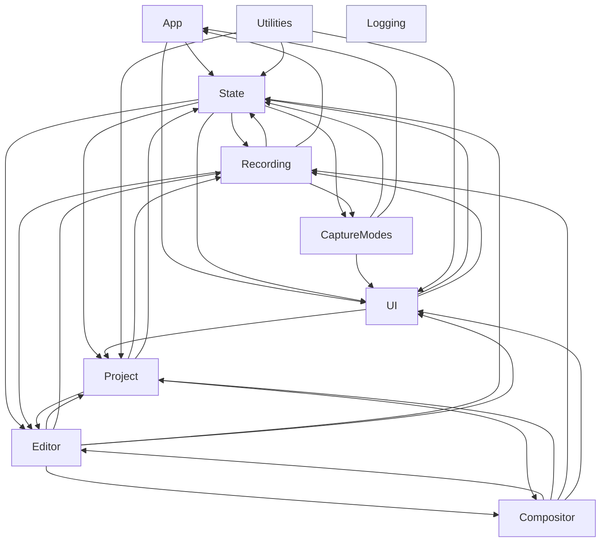

# 01 — Module Map

One section per top-level folder under `Reframed/`. Line counts are `wc -l` over `*.swift` at `v0.14.7` (total ≈ 33 000). "Depends on" / "Used by" were derived by grepping every folder's source for the type names declared in every other folder (top-level `class`/`struct`/`enum`/`actor`/`protocol` declarations); the raw matrix is reproduced at the end.

Reminder: **these folders are not Swift modules.** Everything compiles into the single `Reframed` target with internal access; the dependency direction below is a convention you can *choose* to enforce with tests or a future split, not something the compiler enforces today.

---

## `Agent/`

**Responsibility.** Provider-neutral assistant runtime, one persisted conversation per project, provider discovery/readiness, streamed transcript rendering, and the editor's collapsible chat panel.

| Cluster | Key types | Notes |
| --- | --- | --- |
| Provider protocol | `AgentProvider`, `ClaudeCodeProvider`, `CodexProvider`, `AgentEvent` | Builds safe read-only arguments and reduces versioned NDJSON into typed events. Unknown events are tolerated. |
| Process boundary | `AgentProcessRunner`, `AgentSession` | Actors. One fresh child process per turn; cancellation terminates it. `AgentSession` maps process lines to events and accepts saved provider resume ids. |
| Discovery | `AgentToolchain`, `AgentProbe`, `AgentReadiness` | Actors resolve executables and run bounded version/authentication probes without invoking a real CLI in tests. |
| Persistence | `AgentConversationData`, `AgentConversationStore`, `AgentTranscript` | Exactly one `agent/conversation.json` inside each `.frm`; provider resume ids are stored independently. `AgentTranscript` is `@MainActor @Observable`. |
| UI | `AgentChatPanel`, `AgentConversationView`, `AgentMarkdownView` | Persisted collapse/width, provider picker, explicit clear, streamed Markdown and expandable tool rows. |

The portable conversation lives inside the project bundle. Ephemeral runtime state lives in the sibling `.agent/<project-name>/` workspace. `Agent/` depends on `Project`, `State`, and reusable `UI` tokens; only `EditorState` and `EditorView` depend on it.

## `Reframed/ReframedApp.swift` (29 LOC)

`@main struct ReframedApp: App`. Bootstraps logging (`LogBootstrap.configure()` in `init`), declares the single `MenuBarExtra(.window)` scene, and wires `MenuBarExtraAccess` so `SessionState.statusItemButton` gets the `NSStatusBarButton`. Delegates everything else to `AppDelegate` via `@NSApplicationDelegateAdaptor`.

## `App/` (383 LOC, 3 files)

**Responsibility.** Process lifecycle, permissions, and the AX/CGWindow helpers used by window-selection mode.

| Type | File | Notes |
| --- | --- | --- |
| `AppDelegate` (`@MainActor final class`, `NSApplicationDelegate`, `NSWindowDelegate`) | `Reframed/App/AppDelegate.swift` | Owns `let session = SessionState()` and `KeyboardShortcutManager`; starts `SparkleUpdater.shared`; installs a local left-mouse-down monitor that turns a status-item click into `session.stopRecording()` while recording/paused; handles `.frm` opens via `application(_:open:)`; shows the permissions window. |
| `Permissions` (enum) | `Reframed/App/Permissions.swift` | Wraps `CGPreflightScreenCaptureAccess`, `AXIsProcessTrusted`, and `SCShareableContent.excludingDesktopWindows(false, onScreenWindowsOnly: true)` (`fetchShareableContent()`), which every capture path uses. |
| `WindowController` (`@MainActor final class`, `ObservableObject`), `WindowInfo` | `Reframed/App/WindowController.swift` | `CGWindowListCopyWindowInfo` + Accessibility (`AXUIElement`) lookups to find, cycle, resize and center windows under the cursor. Note: this is the **only** `ObservableObject`/`@Published` in the codebase; everything else uses `@Observable`. |

Depends on: `State` (`SessionState`, `ConfigService`, `KeyboardShortcutManager`), `UI` (`PermissionsView`, `ReframedColors`), `Utilities` (`SparkleUpdater`).
Used by: `CaptureModes` (`WindowController`, `WindowInfo`), `Recording`/`State`/`UI` (`Permissions`).

## `CaptureModes/` (1 688 LOC, 16 files)

**Responsibility.** The pre-recording selection UI for each capture mode and the shared recording-border overlay.

| Sub-folder | Key types | Files |
| --- | --- | --- |
| `CaptureArea/` | `SelectionOverlayWindow: NSWindow`; `SelectionOverlayView: NSView` (+ `+Controls`, `+Drawing`, `+Resize` extensions: crosshair, drag-to-select, 8 `ResizeHandle`s, the floating `CaptureAreaView` SwiftUI control strip) | `SelectionOverlayWindow.swift`, `SelectionOverlayView*.swift`, `ResizeHandle.swift`, `CaptureAreaView.swift` |
| `CaptureScreen/` | `StartRecordingOverlayView` (SwiftUI), `StartRecordingWindow: NSPanel` | `StartRecordingOverlay.swift` |
| `CaptureWindow/` | `WindowSelectionCoordinator` (`@MainActor`), `WindowSelectionOverlay`, `WindowSelectionView`, `ResizePopover` (AX-based resize presets) | `WindowSelectionCoordinator.swift`, `WindowSelectionOverlay.swift`, `WindowSelectionView.swift`, `ResizePopover.swift` |
| `Common/` | `SelectionCoordinator` (`@MainActor`; one overlay per `NSScreen`, plus `RecordingBorderWindow`), `SelectionRect` (`Sendable` struct; `screenCaptureKitRect` does the AppKit→Quartz Y-flip), `RecordingBorderWindow`, `WindowPositionObserver` (CADisplayLink polling `CGWindowListCopyWindowInfo` for the captured window's frame) | `SelectionCoordinator.swift`, `SelectionRect.swift`, `RecordingBorderWindow.swift`, `WindowPositionObserver.swift` |

The overlays call back into `SessionState` directly (`session.confirmSelection(_:)`, `session.cancelSelection()`, `session.updateWindowHighlight(_:)`), so `CaptureModes` is tightly coupled to `State`.

Depends on: `State` (`SessionState`, `ConfigService`), `App` (`WindowController`, `WindowInfo`), `UI` (buttons, colours, `StartRecordingButton`, `Window.sharingType`).
Used by: `State` (`SelectionCoordinator`, `WindowSelectionCoordinator`, `SelectionRect`, `StartRecordingWindow`, `SelectionOverlayView`, `WindowPositionObserver`), `Recording` (`SelectionRect` inside `CaptureTarget`; `ResizeHandle`).

## `Compositor/` (6 817 LOC, 28 files)

**Responsibility.** Everything from `ExportConfiguration` to a finished file: composition building, per-frame CoreGraphics rendering, audio mixing, GIF encoding, plus the export settings model and the `ExportSheet` UI.

| Type | File | Notes |
| --- | --- | --- |
| `VideoCompositor` (enum, static API) | `VideoCompositor.swift` | `export(result:config:progressHandler:)` orchestrator. Extensions: `+InstructionBuilder` (`checkNeedsCompositor`, `computeCanvasSize`, `computeRenderSize`, `buildCompositionInstruction`), `+Audio` (`addAudioTracks`, `buildAudioMix`), `+AudioPreprocessing` (`processMicrophoneAudio` → RNNoise, `generateClickSound`), `+Background`, `+RegionRemapping` (source-time → composition-time when video regions cut the timeline), `+ManualExport`, `+ParallelExport`, `+GIFExport`. |
| `ExportConfiguration` (`struct … Sendable`) | `ExportConfiguration.swift` | The frozen snapshot of editor settings handed to the compositor (~70 fields). Contains reference types `CursorMetadataSnapshot` and `ZoomTimeline` (both `@unchecked Sendable`, immutable after construction). |
| `ExportSettings` + enums `ExportFormat`, `ExportCodec`, `ExportFPS`, `ExportResolution`, `ExportAudioBitrate`, `ExportMode`, `ExportPreset`, `GIFQuality`, `CaptionExportMode` | `ExportSettings.swift` | Pure value types; presets table lives in `ExportPreset.settings`. |
| `CompositionInstruction` (`final class`, `AVVideoCompositionInstructionProtocol`, `@unchecked Sendable`), `RegionTransitionInfo`, `CameraCustomRegion`, `VideoSegmentMapping` | `CompositionInstruction.swift` | Immutable per-export parameter object read by every render worker. The `AVVideoCompositionInstructionProtocol` conformance is vestigial (see `FrameRenderer`). |
| `FrameRenderer` (`final class NSObject, AVVideoCompositing, @unchecked Sendable`) | `FrameRenderer.swift` + `+Background`, `+Screen`, `+Webcam`, `+Cursor`, `+Spotlight`, `+Captions`, `+HDR`, `+Helpers` | The real entry point is `static func renderFrame(screenBuffer:webcamBuffer:outputBuffer:compositionTime:instruction:processedWebcamImage:)`; `computeFrameState` derives the per-frame `FrameState`. `startRequest(_:)` (the `AVVideoCompositing` path) is never invoked because nothing builds an `AVVideoComposition`. Renders into `kCVPixelFormatType_64RGBAHalf` buffers. |
| `PersonSegmentationProcessor`, `SegmentationProcessorPool` (`@unchecked Sendable`) | `PersonSegmentationProcessor.swift` | Vision `VNGeneratePersonSegmentationRequest` for webcam background replacement; the pool hands one processor per parallel worker. |
| `BackgroundStyle`, `BackgroundImageFillMode`, `CameraBackgroundStyle`, `CameraLayout`, `GradientPreset`/`GradientPresets` | `BackgroundStyle.swift`, `CameraBackgroundStyle.swift`, `CameraLayout.swift`, `GradientPresets.swift` | `Codable`/`Sendable` model types **persisted in `project.json`** — they belong conceptually to `Project/` but live here. |
| `ExportSheet` (SwiftUI `View`) + `ExportPhase` | `ExportSheet.swift`, `ExportSheet+Phases.swift` | Takes `@Bindable var editorState: EditorState`; `startExport()` spawns the `Task` that calls `EditorState.export(settings:)`. UI code inside `Compositor/`. |

Depends on: `Editor` (`EditorState` via `ExportSheet`; `CursorMetadataSnapshot`, `CursorRenderer`, `SystemCursorRenderer`, `CursorEffects`, `CursorStyle`, `ZoomTimeline`, `CanvasAspect`, `CameraAspect`, `CameraFullscreen*`), `Project` (caption + spotlight + `RegionTransitionType` types), `Recording` (`RecordingResult`), `State` (`CaptureError`), `UI` (button styles, `SegmentPicker`, colours), `Utilities` (`EncodingSettings`, `RNNoiseProcessor`, `ClickSoundGenerator`, `CodableColor`, `MediaFileInfo`).
Used by: `Editor` (everything above), `Project` (`BackgroundStyle`, `CameraLayout`, `CameraBackgroundStyle`, `BackgroundImageFillMode` inside `EditorStateData`).

## `Editor/` (12 050 LOC, ~74 files — the largest folder)

**Responsibility.** The editing session: state, playback, timeline UI, properties panels, preview rendering (AppKit layers), cursor/zoom/caption logic, undo history.

| Cluster | Key types | Files |
| --- | --- | --- |
| State | `EditorState` (`@MainActor @Observable`), split across `EditorState.swift` (properties, two inits, `setup()`) and extensions `+Persistence` (`createSnapshot`, `restoreFromSnapshot`, `observeChanges`, `scheduleSave`, `teardown`), `+Export`, `+Playback`, `+Project`, `+Background`, `+CameraLayout`, `+CameraRegions`, `+AudioRegions`, `+VideoRegions`, `+SpotlightRegions`, `+Zoom`, `+Cursor`, `+Captions` | `EditorState*.swift` |
| Playback | `SyncedPlayerController` (`@MainActor @Observable`): one `AVPlayer` each for screen, webcam, system audio; mic through `AVAudioEngine`/`AVAudioPlayerNode`; per-track drift ratios; 60 Hz periodic time observer | `SyncedPlayerController.swift` |
| History | `History` (`@MainActor @Observable`, 50 snapshots), `HistoryEntry`/`HistoryData` (Codable), change-description rules | `History.swift`, `History+ChangeRules.swift`, `HistoryPopover.swift` |
| Window + root views | `EditorWindow`, `EditorView` (+ `+Preview`, `+Sidebar`, `+TransportBar`), `EditorTopBar`, `EditorTab`, `PropertiesPanel` (+ `+GeneralTab`, `+VideoTab`, `+Background`, `+CameraTab`, `+CursorZoomTab`, `+EffectsTab`, `+AudioTab`, `+CaptionsTab`) | `EditorWindow.swift`, `EditorView*.swift`, `PropertiesPanel*.swift` |
| Timeline | `TimelineView` (+ `+Ruler`, `+ScreenTrack`, `+AudioTrack`, `+CameraTrack`, `+SpotlightTrack`, `+Overlays`, `+Shared`), `TrimHandle`, region edit popovers (`RegionEditPopover`, `CameraRegionEditPopover`, `VideoRegionEditPopover`, `SpotlightRegionEditPopover`), `ZoomKeyframeEditor` (+ `+Logic`, `+RegionView`), `ZoomRegion`, `AudioWaveformGenerator` | `TimelineView*.swift`, `ZoomKeyframeEditor*.swift`, … |
| Preview | `VideoPreviewView: NSViewRepresentable` (+ `+Update`, `+Coordinator`, `+Transitions`), `VideoPreviewContainer: NSView` (+ `+Layout`, `+Interaction`, `+Cursor`, `+Spotlight`, `+Webcam`), `CursorOverlayLayer`, `SpotlightOverlayLayer`, `WebcamCameraView`, `CmdScrollZoomOverlay`, `RightClickOverlay` | `VideoPreview*.swift`, `*OverlayLayer.swift` |
| Cursor & zoom engines (pure logic, reused by the compositor) | `CursorMetadataFile`/`CursorSample`/`CursorClickEvent`/`KeystrokeEvent`/`SystemCursorType` (Codable), `CursorMetadataProvider` + `CursorMetadataSnapshot` (`@unchecked Sendable`), `CursorRenderer` + `CursorStyle`, `SystemCursorRenderer`, `CursorEffects`, `CursorSmoothing` + `CursorMovementSpeed`, `CursorLoopTelemetry`, `ZoomTimeline` + `ZoomKeyframe`, `ZoomDetector` + `ZoomDetectorConfig`, `ClickSoundPlayer` | `CursorMetadata.swift`, `CursorMetadataProvider.swift`, `CursorRenderer*.swift`, `SystemCursorRenderer.swift`, `CursorEffects.swift`, `CursorSmoothing.swift`, `ZoomTimeline.swift`, `ZoomDetector.swift`, … |
| Shared enums | `CanvasAspect`, `CameraAspect`, `CameraFullscreenFillMode`, `CameraFullscreenAspect` | `EditorTypes.swift` |

Depends on: `Compositor` (13 types incl. `ExportSheet`, `FrameRenderer`, `PersonSegmentationProcessor`, model types), `Project` (19 data types), `Recording` (`RecordingResult`), `State` (`CaptureMode`, `CaptureQuality`, `ConfigService`, `StateService`), `UI` (26 components), `Utilities` (RNNoise, Whisper, click sounds, `SubtitleExporter`, `MediaFileInfo`, `CodableColor`).
Used by: `State` (`EditorWindow`), `Compositor` (cursor/zoom engines, enums, `EditorState`), `Project` (`ZoomKeyframe`, `HistoryData`, `CursorMovementSpeed`, the `EditorTypes` enums), `Recording` (`CursorSample`, `CursorClickEvent`, `KeystrokeEvent`, `CursorMetadataFile`, `SystemCursorType` — written by `CursorMetadataRecorder`).

## `Libraries/` (0 Swift LOC)

`Reframed/Libraries/gifski/gifski.h` (346 lines), `libgifski.a` (static, prebuilt, arm64 + x86_64 per the `make release` `ARCHS` setting — verify with `lipo -info`), and `module.modulemap` (`module gifski { header "gifski.h"; export * }`). Wired via pbxproj `LIBRARY_SEARCH_PATHS`, `SWIFT_INCLUDE_PATHS` (both `$(PROJECT_DIR)/Reframed/Libraries/gifski`) and `OTHER_LDFLAGS = "-lgifski"`. Imported only by `Reframed/Compositor/VideoCompositor+GIFExport.swift`. License and provenance: see `04-dependencies.md`.

## `Logging/` (100 LOC, 2 files)

`LogBootstrap.configure()` (`Reframed/Logging/LogBootstrap.swift`) bootstraps swift-log: `StreamLogHandler.standardOutput` in `DEBUG`; in release a `MultiplexLogHandler` adding `RotatingFileLogHandler` (`Reframed/Logging/RotatingFileLogHandler.swift`: `~/Library/Logs/Reframed/reframed.log`, 5 MB, 3 rotated files, appends on a private serial queue). Every logger is `Logger(label: "eu.jankuri.reframed.<component>")`; 24 files import `Logging`.

Depends on: nothing internal. Used by: `ReframedApp` only (everything else uses swift-log's `Logger` directly).

## `Project/` (829 LOC, 2 files)

**Responsibility.** The `.frm` bundle format and the on-disk representation of editor state.

| Type | File | Notes |
| --- | --- | --- |
| `ReframedProject` (`struct … Sendable`) | `Reframed/Project/ReframedProject.swift` | `create(from:fps:captureMode:sourceName:in:)` moves the temp files into a new bundle and writes `project.json`; `open(at:)`; `saveEditorState(_:)`; `rename(to:)`; `saveHistory(_:)` / `loadHistory()`; `delete()`; computed URLs for each media file; `recordingResult` reconstructs a `RecordingResult` from the bundle. |
| `ProjectMetadata`, `EditorStateData`, and the region/settings structs (`CursorSettingsData`, `ZoomSettingsData`, `AnimationSettingsData`, `AudioSettingsData`, `AudioRegionData`, `CameraRegionData`, `VideoRegionData`, `SpotlightRegionData`, `CaptionSettingsData`, `CaptionSegment`, `CaptionWord`, `CaptionPosition`, enums `RegionTransitionType`, `CameraRegionType`, `CaptionFontWeight`, `CaptionLanguage`, `CaptionAudioSource`, `CaptionLayout`, `CodableSize`) | `Reframed/Project/ProjectMetadata.swift` | All `Codable, Sendable`. Lenient decoding via `decodeOrDefault` (`Reframed/Utilities/LenientCodable.swift`) in `init(from:)` extensions so older `project.json` files load — this file is one of only five with code comments in the whole tree (18 `//` lines total; the others are `FrameRenderer+Helpers.swift`, `FrameRenderer+HDR.swift`, `SelectionOverlayView.swift`, `RotatingFileLogHandler.swift`) — the `// MARK: - Lenient Decoders` block here explains the convention. |

Depends on: `Compositor` (`BackgroundStyle`, `CameraLayout`, `CameraBackgroundStyle`, `BackgroundImageFillMode`), `Editor` (`ZoomKeyframe`, `HistoryData`, `CursorMovementSpeed`, `CanvasAspect`, `CameraAspect`, `CameraFullscreen*`), `Recording` (`RecordingResult`), `State` (`CaptureMode`, `CaptureQuality`, `CaptureError`), `Utilities` (`CodableColor`, `formatTimestamp`).
Used by: `State`, `Editor`, `Compositor`, `UI` (`ProjectMetadata` for the recent-projects list), `Utilities` (`CaptionSegment` in `SubtitleExporter`/`TranscriptionService`).

## `Recording/` (3 632 LOC, 23 files)

**Responsibility.** Live capture: sources, writers, clock, cursor metadata, device discovery, and the preview windows shown *during* recording.

| Type | File | Isolation | Notes |
| --- | --- | --- | --- |
| `RecordingCoordinator` | `RecordingCoordinator.swift` + `+Screen`, `+Device`, `+Lifecycle` | `actor` | Owns one of each source/writer as optionals; `startRecording(target:…)` / `startDeviceRecording(…)`; `pause()`/`resume()` compute `totalPauseOffset`; `stopRecordingRaw()` → `RecordingResult`; `stopRecording()` → single merged file (used only by `restartRecording`'s discard path). |
| `ScreenCaptureSession` | `ScreenCaptureSession.swift` | `@unchecked Sendable`, `SCStreamDelegate`/`SCStreamOutput` | Configures `SCStream`; delivers samples on `videoWriter.queue`; duplicates the last `CVPixelBuffer` for `.idle` frames; `onPreviewFrame` callback. |
| `SystemAudioCapture` | `SystemAudioCapture.swift` | `@unchecked Sendable` | Second `SCStream`, 2×2 px dummy video discarded on a background queue, audio on `audioWriter.queue`. |
| `WebcamCapture`, `MicrophoneCapture`, `DeviceCapture` | respective files | `@unchecked Sendable`, `AVCapture*DataOutputSampleBufferDelegate` | `startAndVerify(...)` waits for the first sample via `withCheckedThrowingContinuation` with a 3–5 s timeout; `attachWriter`/`detachWriter` re-point the sample delegate queue at the writer's queue. |
| `VideoTrackWriter`, `AudioTrackWriter` | `VideoTrackWriter.swift`, `AudioTrackWriter.swift` | `@unchecked Sendable` + private serial queue | `AVAssetWriter` wrappers; register with the clock on first sample; `AudioTrackWriter` also does drift correction against `videoPTSProvider`, peak metering, and a 4 800-sample pending buffer. |
| `SharedRecordingClock` | `SharedRecordingClock.swift` | `@unchecked Sendable` (NSLock) | See `02-concurrency.md`. |
| `CursorMetadataRecorder` | `CursorMetadataRecorder.swift` | `@unchecked Sendable` (NSLock) | 8 ms `DispatchSourceTimer` sampling `NSEvent.mouseLocation`; 16 ms main-queue timer for cursor type; `adjustTimestamps(by:)`, `writeToFile(at:)`. |
| `MouseClickMonitor` | `MouseClickMonitor.swift` | `@MainActor` | Global `NSEvent` monitors for clicks and keystrokes → recorder. |
| `CaptureTarget` (`enum … @unchecked Sendable`: `.region(SelectionRect)` / `.window(SCWindow)`), `RecordingResult` | `CaptureTarget.swift`, `RecordingResult.swift` | | |
| `DeviceDiscovery` (`@MainActor @Observable` singleton), `ExternalDevice` | `DeviceDiscovery.swift` | | iOS devices via `AVCaptureDevice.DiscoverySession(deviceTypes: [.external], mediaType: .muxed)`. |
| `WebcamPreviewWindow`, `RecordingPreviewWindow`, `DevicePreviewWindow`, `MouseClickWindow` | respective files | `@MainActor` | Preview panels (UI code inside `Recording/`). |
| `VideoTranscoder` (enum) | `VideoTranscoder.swift` | | `merge(videoFile:audioFiles:to:)`; only used by `RecordingCoordinator.stopRecording` (the discard path). |
| `FileManager` extension | `FileManager+Reframed.swift` | some `@MainActor` | temp URLs under `/tmp/Reframed`, `projectSaveDirectory()`, `defaultSaveURL(for:extension:)`, `moveToFinal`, `cleanupTempDir`. |

Depends on: `State` (`CaptureError`, `CaptureMode`, `CaptureQuality`, `ConfigService`, `StateService`), `App` (`Permissions`), `CaptureModes` (`SelectionRect`, `ResizeHandle`), `Editor` (cursor metadata Codable types), `UI` (colours, `StartRecordingButton`, `Window`), `Utilities` (`EncodingSettings`, `SendableBox`).
Used by: `State` (12 types), `Editor`/`Compositor`/`Project` (`RecordingResult`), `UI` (`DeviceDiscovery`, `ExternalDevice`).

## `State/` (1 752 LOC, 14 files)

**Responsibility.** The application-level state machine, persisted preferences, recording options, and keyboard shortcuts.

| Type | File | Notes |
| --- | --- | --- |
| `SessionState` (`@MainActor @Observable final class`) | `SessionState.swift` + `+Recording`, `+Selection`, `+Project`, `+UI`, `+Camera`, `+Audio`, `+WindowInfo` | `var state: CaptureState`; `transition(to:)` is the single mutation point and also drives side effects (audio-level polling, window tracking, toolbar visibility, status icon). Owns every coordinator and window listed in `00-overview.md`. |
| `CaptureState` (`enum … Sendable, Equatable`), `CaptureError` (`LocalizedError`) | `CaptureState.swift` | `.idle, .selecting, .countdown(remaining:), .recording(startedAt:), .paused(elapsed:), .processing, .editing`. |
| `CaptureMode` (`enum String … Codable`) | `CaptureMode.swift` | `.none, .entireScreen, .selectedWindow, .selectedArea, .device`; also hosts `cameraMaxDimensions(for:)`. |
| `RecordingOptions` (`@MainActor @Observable`) + `CaptureQuality`, `TimerDelay`, `AudioDevice`, `CaptureDevice` | `RecordingOptions.swift` | Each property's `didSet` writes through to `ConfigService`. |
| `ConfigService`, `StateService` (`@MainActor` singletons) | `ConfigService.swift`, `StateService.swift` | JSON files under `~/.reframed/`; `ConfigService.load()` merges saved keys over encoded defaults. |
| `KeyboardShortcutManager` (`@MainActor`) | `KeyboardShortcutManager.swift` | Local `NSEvent` monitor + `CGEventTap`; `TapContext` (`@unchecked Sendable`) carries a weak manager ref through `userInfo`. |

Depends on: `Recording` (12 types), `CaptureModes` (6), `Editor` (`EditorWindow`), `Project` (`ReframedProject`), `UI` (`CaptureToolbarWindow`, `Window`), `Utilities` (`MenuBarIcon`, `SoundEffect`, `KeyboardShortcut`, `ShortcutAction`, `SendableBox`), `App` (`Permissions`).
Used by: `App`, `CaptureModes`, `Editor`, `Recording`, `UI`, `Compositor`/`Project`/`Utilities` (`CaptureError`, `CaptureQuality`, `CaptureMode`).

## `UI/` (3 910 LOC, ~46 files)

**Responsibility.** Reusable SwiftUI components and the non-editor screens (toolbar, menu bar popover, settings, permissions).

Key files: `CaptureToolbar.swift` (+ `+Controls`, `+ModeSelection`, `CaptureToolbarComponents.swift`, `CaptureToolbarWindow.swift`), `MenuBarView.swift` (+ `+Projects`, `MenuBarComponents.swift` with `RecentProject`), `SettingsView.swift` + `SettingsGeneralTab`/`RecordingTab`/`DevicesTab`/`ShortcutsTab`/`AboutTab`, `PermissionsView.swift`, `Colors.swift` (`ReframedColors` — `@MainActor` because it reads `NSApp.effectiveAppearance`; `TailwindColors`, `ColorPreset`), `Constants.swift` (`Window`, `Layout`, `Track`, `FontSize`, `Radius`), `PrimaryButton.swift` (`PrimaryButtonStyle`, `SecondaryButtonStyle`, `OutlineButtonStyle`, `PlainCustomButtonStyle` — the only button styles the project allows), `SegmentPicker`, `SliderRow`, `ToggleRow`, `CustomToggle`, `Dropdown`, `IconButton`, `SectionHeader`, `SwatchButton`, `TailwindColorPicker`, `ImageDropSection`, `InlineEditableText`, `LanguagePicker`, `CaptionOverlayView`, `CaptionSegmentRow`, `TransitionControlsSection`, `ShortcutRecorderButton`/`ShortcutCaptureView`/`ShortcutRow`, `StartRecordingButton` (the countdown lives here), `DevicePopover`/`DevicePickerPopover`/`OptionsPopover`/`AreaSizePresetsPopover`, `HoverEffect`.

Depends on: `State` (9 types incl. `SessionState`, `RecordingOptions`), `Project` (caption types, `ProjectMetadata`), `Recording` (`DeviceDiscovery`, `ExternalDevice`), `Utilities` (`CodableColor`, shortcuts, `SparkleUpdater`, `UpdateChecker`), `App` (`Permissions`). (The grep also matched `TimelineView` in `CaptureToolbarComponents.swift`; that is `SwiftUI.TimelineView`, not the editor's — no real `UI → Editor` dependency.)
Used by: every other folder except `Logging`.

## `Utilities/` (1 843 LOC, 20 files)

Not just "extensions and helpers": several substantial engines live here.

| Type | File | Notes |
| --- | --- | --- |
| `RNNoiseProcessor` (enum) + private `RNNoiseProgressTracker` (actor) + `ChunkParams` | `RNNoiseProcessor.swift` | Chunked, `withThrowingTaskGroup`-parallel RNNoise denoise; 48 kHz mono conversion; dry/wet blend by intensity. |
| `TranscriptionService` (enum), `WhisperModelManager` (`@MainActor @Observable` singleton), `WhisperModel` | `TranscriptionService.swift`, `WhisperModelManager.swift` | WhisperKit integration; models in `~/.reframed`. |
| `ClickSoundGenerator`, `ClickSoundStyle`, `ClickSoundCategory`, `ClickSoundData` | `ClickSoundGenerator.swift`, `ClickSoundData.swift` | Synthesises the click-sound audio track for export. |
| `EncodingSettings` (enum) | `EncodingSettings.swift` | `captureVideoSettings`, `exportVideoSettings`, `aacAudioSettings`; `bt709ColorProperties` is `nonisolated(unsafe) static let`. |
| `SparkleUpdater` (`@MainActor` singleton), `UpdateChecker` | `SparkleUpdater.swift`, `UpdateChecker.swift` | See `04-dependencies.md`. |
| `KeyboardShortcut`, `ShortcutAction` | `KeyboardShortcut.swift` | Codable shortcut model + default bindings. |
| `SendableBox<T>` | `SendableBox.swift` | 7-line `@unchecked Sendable` wrapper; used exactly once (`AVCaptureSession` from `RecordingCoordinator` to `SessionState`). |
| `CodableColor`, `MenuBarIcon`, `SoundEffect` (`@MainActor`), `SubtitleExporter`, `MediaFileInfo`, `LenientCodable`, `MathUtilities`, `TimeFormatting` (`formatTimestamp`, `formatDuration`), `CGRect+Extensions`, `NSScreen+Extensions` (`displayID`, `screen(for:)`, `primaryScreenHeight`) | | |

Depends on: `State` (`CaptureError`, `CaptureQuality`), `Project` (`CaptionSegment`, `CaptionWord`). (The grep also reports `UI` via `Window`; that is the word in a shortcut label, not the `Window` enum.)
Used by: everything.

---

## Where the complexity is (15 largest files)

| LOC | File | What is in it |
| --- | --- | --- |
| 852 | `Reframed/Compositor/VideoCompositor+ParallelExport.swift` | GCD render farm, hand-rolled queue/condition primitives, ordered writer |
| 649 | `Reframed/Compositor/GradientPresets.swift` | 86 gradient presets (data) |
| 612 | `Reframed/Project/ProjectMetadata.swift` | the entire persisted schema + lenient decoders |
| 607 | `Reframed/Compositor/FrameRenderer+HDR.swift` | HDR/P3 render paths |
| 483 | `Reframed/Editor/VideoPreviewContainer+Layout.swift` | layer geometry for preview (padding, zoom, PiP, transitions) |
| 456 | `Reframed/Editor/EditorState+Persistence.swift` | snapshot/restore, observation loop, autosave, undo scheduling |
| 412 | `Reframed/Editor/CursorOverlayLayer.swift` | preview cursor rendering (CALayer) |
| 385 | `Reframed/Editor/History+ChangeRules.swift` | undo-label diff rules |
| 384 | `Reframed/State/SessionState+Recording.swift` | start/stop/pause/restart/device lifecycle |
| 374 | `Reframed/Compositor/VideoCompositor+ManualExport.swift` | single-threaded reader/writer export |
| 373 | `Reframed/Compositor/ExportSettings.swift` | export enums + presets |
| 371 | `Reframed/Utilities/RNNoiseProcessor.swift` | chunked parallel denoise |
| 366 | `Reframed/Recording/RecordingPreviewWindow.swift` | live-preview panel |
| 363 | `Reframed/Editor/EditorState.swift` | properties + init + `setup()` |
| 357 | `Reframed/Compositor/FrameRenderer+Webcam.swift` | PiP/fullscreen webcam drawing |

Two of the top five are pure data (`GradientPresets`, `ProjectMetadata`); the rest are the rendering and lifecycle code where regressions would hide. `VideoPreviewContainer+Layout.swift` and `FrameRenderer+*.swift` implement the same geometry twice (preview vs export) — see `03-data-flow.md` §B.2.

---

## Dependency direction

Because the target is one module, the picture is a graph, not a layer cake. The diagram shows the *dominant* direction (thick edges = many distinct types referenced) and marks the back-edges that make cycles.



(Edges into `Utilities` and `Logging` from everywhere are omitted for readability.)

### Cyclic and surprising dependencies

| Cycle / surprise | Evidence | Why it matters for testing |
| --- | --- | --- |
| **`Editor` ⇄ `Compositor`** | `Compositor` uses `EditorState` (`ExportSheet.swift`), `CursorRenderer`, `SystemCursorRenderer`, `CursorEffects`, `ZoomTimeline`, `CursorMetadataSnapshot`, `CanvasAspect`, `CameraAspect`; `Editor` uses `ExportSheet`, `FrameRenderer`, `PersonSegmentationProcessor`, `ExportConfiguration`, model types | The compositor cannot be extracted into its own module (or tested in isolation) until the cursor/zoom engines move out of `Editor/` and `ExportSheet` moves out of `Compositor/`. Only `ExportSheet` references `EditorState`; the rest is pure logic. |
| **`Editor` ⇄ `Project`** | `Project` uses `ZoomKeyframe`, `HistoryData`, `CursorMovementSpeed`, `CanvasAspect`, `CameraAspect`, `CameraFullscreenFillMode`, `CameraFullscreenAspect`; `Editor` uses 19 `Project` types | Persistence format is entangled with editor enums. Moving `EditorTypes.swift`, `ZoomKeyframe`, `CursorMovementSpeed` and `HistoryData` into `Project/` would break the cycle. |
| **`Project` → `Compositor`** | `EditorStateData` embeds `BackgroundStyle`, `CameraLayout`, `CameraBackgroundStyle`, `BackgroundImageFillMode` | Same fix: those four are data-model types, not compositor code. |
| **`State` ⇄ `Recording`** | `Recording` reads `ConfigService`/`StateService` (preview window positions, `FileManager+Reframed` save dirs) and `CaptureError`; `State` owns every `Recording` type | `RecordingCoordinator` itself only needs `CaptureError`, `CaptureQuality`, `CaptureMode.cameraMaxDimensions`, and `FileManager.tempXURL`; the `ConfigService` reads are in the preview windows and `FileManager+Reframed`. |
| **`State` ⇄ `CaptureModes`**, **`State` ⇄ `UI`**, **`State` ⇄ `Editor`** | overlays and toolbar call `session.*` directly; `SessionState` instantiates them | Expected for a hub type, but it means `SessionState` cannot be constructed in a test without AppKit windows being creatable (its `init` only touches `ConfigService`, which is fine; the window-creating paths are in `showToolbar`/`beginSelection`). |
| **`Recording` → `Editor`** | `CursorMetadataRecorder` writes `CursorMetadataFile`/`CursorSample`/… declared in `Reframed/Editor/CursorMetadata.swift` | The cursor JSON schema is an `Editor` type used by the recorder. Belongs in `Project/`. |
| **`Recording` → `CaptureModes`** | `CaptureTarget.region(SelectionRect)` | `SelectionRect` is a value type with an `NSScreen` lookup in its `init`; fine for tests on a machine with a display. |
| **`CaptureModes` → `App`** | `WindowSelectionCoordinator` owns a `WindowController` | `WindowController` is an AX helper, not app-lifecycle code; it would sit better in `CaptureModes/CaptureWindow/`. |
| **`Utilities` → `State`/`Project`** | `RNNoiseProcessor` throws `CaptureError.recordingFailed` and reads `CaptureQuality`/`EncodingSettings`; `SubtitleExporter`/`TranscriptionService` use `CaptionSegment`/`CaptionWord` | "Utilities" is not a leaf. The `CaptureError` coupling is the one to remove first (introduce a local error type). (The matrix's `Utilities → UI: Window` hit is a false positive — the word "Window" appears in a shortcut label string, not as the `Window` enum.) |
| UI code outside `UI/` | `ExportSheet*` in `Compositor/`; `*PreviewWindow` in `Recording/`; `CaptureAreaView`/`StartRecordingOverlay` in `CaptureModes/`; all of the editor UI in `Editor/` | `AGENTS.md`'s "put reusable views in `UI/`" applies to *reusable* components only. |
| `WindowController` is the sole `ObservableObject` | `Reframed/App/WindowController.swift` | Mixed observation systems; harmless but inconsistent. |

### Raw cross-folder reference matrix (distinct type names referenced)

```
App        -> State 3, UI 2, Utilities 1
CaptureModes -> App 2, State 2, UI 9
Compositor -> Editor 11, Project 7, Recording 1, State 1, UI 5, Utilities 6
Editor     -> Compositor 13, Project 19, Recording 1, State 4, UI 26, Utilities 10
Project    -> Compositor 4, Editor 7, Recording 1, State 3, UI 1, Utilities 1
Recording  -> App 1, CaptureModes 2, Editor 5, State 5, UI 4, Utilities 2
State      -> App 1, CaptureModes 6, Editor 1, Project 1, Recording 12, UI 2, Utilities 5
UI         -> App 1, Project 7, Recording 2, State 9, Utilities 5   (Editor 1 = SwiftUI.TimelineView false positive)
Utilities  -> Project 2, State 2   (UI 1 = "Window" string false positive)
Logging    -> (none)
```
