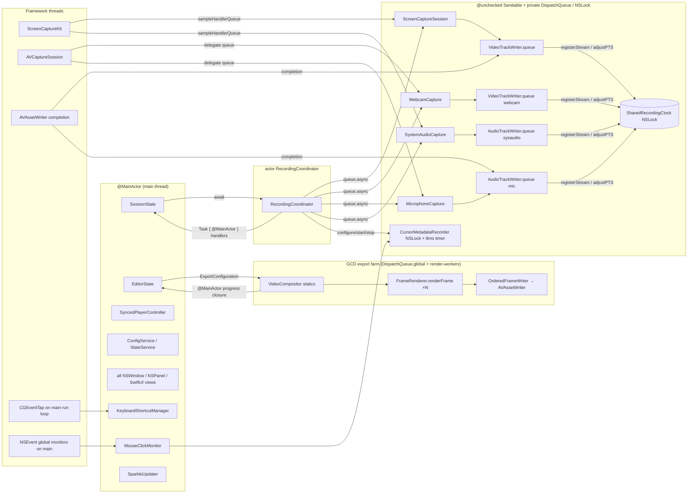

# 02 — Concurrency and Isolation Map

The project compiles with `SWIFT_VERSION = 6.0` (strict concurrency is the default language mode; no `SWIFT_STRICT_CONCURRENCY` override and no `SWIFT_DEFAULT_ACTOR_ISOLATION` setting exist in `Reframed.xcodeproj/project.pbxproj`, so the default is **nonisolated**, not main-actor-by-default).

The mental model in `AGENTS.md` ("everything is actor-isolated; writers are actors") is wrong in detail. The real model is:

> **One `@MainActor` world** (all state, all UI, both singletons) → **one actor** (`RecordingCoordinator`) → **a set of `@unchecked Sendable` classes that serialise themselves on private `DispatchQueue`s or `NSLock`s** (capture sources, writers, clock, cursor recorder) → **framework callbacks** (SCStream, AVCapture, AVAssetWriter, CGEventTap, CADisplayLink) that arrive on those queues or the main thread.

## 1. Isolation map

### 1.1 `@MainActor` types (declaration-level)

| Type | File | Also `@Observable`? |
| --- | --- | --- |
| `AppDelegate` | `Reframed/App/AppDelegate.swift` | |
| `WindowController` | `Reframed/App/WindowController.swift` | `ObservableObject` |
| `SessionState` (+ every extension file re-declares `@MainActor extension`) | `Reframed/State/SessionState*.swift` | yes |
| `RecordingOptions` | `Reframed/State/RecordingOptions.swift` | yes |
| `ConfigService`, `StateService` | `Reframed/State/ConfigService.swift`, `StateService.swift` | |
| `KeyboardShortcutManager` | `Reframed/State/KeyboardShortcutManager.swift` | |
| `SelectionCoordinator`, `WindowSelectionCoordinator`, `WindowPositionObserver` (+ private `DisplayLinkTarget`), `SelectionOverlayWindow`, `SelectionOverlayView`, `WindowSelectionOverlay`, `RecordingBorderWindow`, `StartRecordingWindow` | `Reframed/CaptureModes/**` | |
| `CaptureToolbarWindow`, `ReframedColors` (enum; reads `NSApp.effectiveAppearance`), `SoundEffect` | `Reframed/UI/CaptureToolbarWindow.swift`, `Colors.swift`; `Reframed/Utilities/SoundEffect.swift` | |
| `MouseClickMonitor`, `WebcamPreviewWindow`, `RecordingPreviewWindow`, `DevicePreviewWindow`, `MouseClickWindow`, `DeviceDiscovery` | `Reframed/Recording/*.swift` | `DeviceDiscovery` yes |
| `EditorWindow`, `EditorState`, `SyncedPlayerController`, `History`, `ClickSoundPlayer`, `AudioWaveformGenerator` | `Reframed/Editor/*.swift` | `EditorState`, `SyncedPlayerController`, `History`, `AudioWaveformGenerator` yes |
| `SparkleUpdater`, `UpdateChecker` (enum), `WhisperModelManager` | `Reframed/Utilities/*.swift` | `WhisperModelManager` yes |
| `FileManager.projectSaveDirectory()`, `defaultSaveDirectory()`, `defaultSaveURL(for:extension:)` (method-level) | `Reframed/Recording/FileManager+Reframed.swift` | because they read `ConfigService` |
| Static previews: `CursorRenderer.previewImage`, `SystemCursorRenderer.previewImage`; `Track.background/borderColor/regionTextColor` | `Reframed/Editor/CursorRenderer.swift`, `SystemCursorRenderer.swift`; `Reframed/UI/Constants.swift` | |

SwiftUI `View` structs are implicitly main-actor. All AppKit `NSWindow`/`NSView` subclasses are main-actor by inheritance.

### 1.2 Actors

| Actor | File | Role |
| --- | --- | --- |
| `RecordingCoordinator` | `Reframed/Recording/RecordingCoordinator.swift` | The only application-level actor. Its state is the set of optional sources/writers plus `pauseStartTime`, `totalPauseOffset`, pixel dimensions. Its methods mostly *dispatch* to queue-confined objects (`videoWriter?.pause()` → `queue.async`), so the actor is a coordination point, not a data path. Sample buffers never pass through it. |
| `RNNoiseProgressTracker` (private) | `Reframed/Utilities/RNNoiseProcessor.swift` | Aggregates progress from parallel denoise chunks and forwards to a `@MainActor` closure. |

### 1.3 `@unchecked Sendable` types and how each one actually achieves safety

| Type | File | Real synchronisation | Comment |
| --- | --- | --- | --- |
| `ScreenCaptureSession` | `Reframed/Recording/ScreenCaptureSession.swift` | All mutable fields touched only on `videoWriter.queue` (SCStream delivers there; `pause()`/`resume()` hop there); `stop()` awaited from the actor | Safe by convention. `onStreamError`/`onPreviewFrame` are set from the actor before `start`. |
| `SystemAudioCapture` | `Reframed/Recording/SystemAudioCapture.swift` | audio samples on `audioWriter.queue`; dummy video on `discardQueue` | `isPaused` written on `audioWriter.queue`, read in the delegate on the same queue. |
| `WebcamCapture`, `MicrophoneCapture`, `DeviceCapture` | `Reframed/Recording/*.swift` | `verifyQueue` for verification; after `attachWriter` the `AVCapture*DataOutput` delegate queue is re-pointed to `writer.queue` | `captureSession` is read from `@MainActor` (`SessionState+Camera`) after `startAndVerify` returns — a benign read of an `AVCaptureSession` reference. |
| `VideoTrackWriter`, `AudioTrackWriter` | `Reframed/Recording/VideoTrackWriter.swift`, `AudioTrackWriter.swift` | Private serial `DispatchQueue` (`eu.jankuri.reframed.video-track-writer.queue`, `…audio-track-writer.<label>.queue`, both `qos: .userInteractive`); `appendSampleBuffer`/`appendSample` assert `dispatchPrecondition(condition: .onQueue(queue))` | `writtenFrames`/`droppedFrames`/`currentPeakLevel`/`lastWrittenPTS` are read off-queue (see hazards). |
| `SharedRecordingClock` | `Reframed/Recording/SharedRecordingClock.swift` | `NSLock` around `_referenceTime` and `firstPTSValues` | Correct. |
| `CursorMetadataRecorder` | `Reframed/Recording/CursorMetadataRecorder.swift` | `NSLock` around all sample arrays and timing state; 8 ms timer on its own queue; 16 ms cursor-type timer on `.main` | Correct; note the two `nonisolated(unsafe) static var` caches for cursor-type detection are only touched on `.main`. |
| `CaptureTarget` (enum) | `Reframed/Recording/CaptureTarget.swift` | none — wraps a non-Sendable `SCWindow` | Passed from `SessionState` into the actor; `SCWindow` is effectively immutable once fetched. |
| `SendableBox<T>` | `Reframed/Utilities/SendableBox.swift` | none | Carries `AVCaptureSession` actor → main. |
| `KeyboardShortcutManager.TapContext` | `Reframed/State/KeyboardShortcutManager.swift` | main run loop | Bridges `CGEventTap` `userInfo` back to the main-actor manager. |
| `CompositionInstruction` | `Reframed/Compositor/CompositionInstruction.swift` | all `let`; contains `CGImage`, `CGColor`, `ZoomTimeline`, `CursorMetadataSnapshot` | Immutable → safe to share among render workers. |
| `FrameRenderer` | `Reframed/Compositor/FrameRenderer.swift` | instance holds one `PersonSegmentationProcessor`; static rendering is stateless | Instances are never actually created by export code (static API only). |
| `PersonSegmentationProcessor`, `SegmentationProcessorPool` | `Reframed/Compositor/PersonSegmentationProcessor.swift` | pool hands out one processor per worker | Vision requests are not thread-safe, hence the pool. |
| `VideoCompositor` private helpers: `CancelToken`, `SafeContinuation`, `DoneCondition`, `CountingCondition`, `FrameJobQueue`, `Metrics`, `OrderedFrameWriter`, `FrameJob` (struct), `AudioState` | `Reframed/Compositor/VideoCompositor+ParallelExport.swift` | `NSLock` / `NSCondition` | Hand-rolled primitives for the GCD-based render farm (see §3.3). |
| `ExportProgressPoller` | `Reframed/Compositor/VideoCompositor+ManualExport.swift` | wraps `AVAssetExportSession.progress` reads | Used from a `Task.detached` polling loop. |
| `ZoomTimeline` | `Reframed/Editor/ZoomTimeline.swift` | `NSLock` around `keyframes` (which is never mutated after `init`) | Immutable in practice; `EditorState` replaces the whole instance on every edit, which is also what makes `@Observable` notice the change. |
| `CursorMetadataProvider`, `CursorMetadataSnapshot` | `Reframed/Editor/CursorMetadataProvider.swift` | all `let` | Provider is used on main; snapshot is the export-time copy. |
| `ChunkParams` (struct) | `Reframed/Utilities/RNNoiseProcessor.swift` | raw pointers into disjoint buffer ranges | Each task group child owns a disjoint slice. |

Plain `Sendable` value types (structs/enums) are used for every cross-subsystem handoff: `RecordingResult`, `ReframedProject`, `ProjectMetadata`/`EditorStateData` and friends, `ExportConfiguration`, `ExportSettings`, `SelectionRect`, `CaptureState`, `CaptureMode`, `CaptureQuality`, `CodableColor`, `KeyboardShortcut`, `MediaFileInfo`, `GitHubRelease`, `VerifiedCamera`/`VerifiedDevice`, `MicrophoneFormat`, `ExternalDevice`, `AudioDevice`, `CaptureDevice`.

### 1.4 `nonisolated` and `nonisolated(unsafe)`

`nonisolated(unsafe)` appears ~70 times. They fall into four patterns:

| Pattern | Examples | Assessment |
| --- | --- | --- |
| **Notification/monitor tokens stored on `@MainActor` classes so `deinit` can remove them** | `CaptureToolbarWindow.sizeObserver/moveObserver`, `WindowSelectionCoordinator.eventMonitor/refreshTimer`, `WindowPositionObserver.displayLink`, `DeviceDiscovery.connectObserver`, `ShortcutCaptureView.monitor`, `*PreviewWindow.moveObserver` | Idiomatic Swift 6 workaround for non-isolated `deinit`. Fine. |
| **Local `let` rebinding of non-Sendable AVFoundation objects before capturing them in a `@Sendable` closure or GCD block** | `VideoCompositor+ManualExport.swift:179-191`, `+ParallelExport.swift:540-549`, `+GIFExport.swift:74-79`, `VideoTrackWriter.swift:170`, `AudioTrackWriter.swift:263`, `WebcamCapture.swift:106/126`, `DeviceCapture.swift:64/77`, `RecordingPreviewWindow.swift:69`, `VideoPreviewContainer+Webcam.swift:61` | The dominant pattern for "I know this object is only used from the queue I am about to dispatch to". This is what `AGENTS.md` means by "CVPixelBuffer across actors: `nonisolated(unsafe)` + `@Sendable` closure". Correctness relies entirely on the surrounding queue discipline. |
| **Cross-queue "latest value" fields** | `AudioTrackWriter.currentPeakLevel`, `AudioTrackWriter.lastWrittenPTS`, `VideoTrackWriter.lastWrittenPTS`, `RecordingPreviewWindow.lastUpdateTime`, `TranscriptionService` `highWaterMark`, `RNNoiseProcessor` progress locals | Deliberate benign races (a `Float`/`CMTime` read for a meter or drift check). Not torn on Apple silicon in practice, but unsynchronised. |
| **Static caches / constants** | `SystemCursorRenderer.imageCache` (guarded by `cacheLock`), `CursorMetadataRecorder.lastCursorPointer/Result` (main-only), `ResizeHandle` cursors, `EncodingSettings.bt709ColorProperties`, `TimelineView.trackTransition` | Fine. |

`nonisolated` (safe) is used for genuinely thread-agnostic entry points: `RecordingPreviewWindow.updateFrame(_:)` (called from the SCStream queue, hops to main), `KeyboardShortcutManager.eventTapCallback` (C callback), `UpdateChecker.fetchLatestChangelog()`, `AudioWaveformGenerator.extractSamples/downsample`, `MenuBarView.directorySize`, `VideoPreviewContainer.outputMediaDataWillChange`.

### 1.5 Dispatch queues (all labels)

| Label | Owner | QoS | Purpose |
| --- | --- | --- | --- |
| `eu.jankuri.reframed.video-track-writer.queue` | `VideoTrackWriter.queue` | userInteractive | SCStream screen output + webcam `AVCaptureVideoDataOutput` deliver here; all writer state |
| `eu.jankuri.reframed.audio-track-writer.<label>.queue` (`mic`, `sysaudio`, `device-audio`) | `AudioTrackWriter.queue` | userInteractive | SCStream audio / mic / device audio deliver here |
| `eu.jankuri.reframed.system-audio-capture.discard` | `SystemAudioCapture` | background | swallow the 2×2 dummy video frames |
| `eu.jankuri.reframed.cursor-metadata` | `CursorMetadataRecorder` | userInteractive | 8 ms sampling timer |
| `eu.jankuri.reframed.webcam-verify`, `mic-verify`, `device-verify`, `device-audio` | capture sources | userInteractive | first-sample verification before a writer is attached |
| `eu.jankuri.reframed.webcam-start`, `device-start` | capture sources | default | `AVCaptureSession.startRunning()` off the caller's thread |
| `eu.jankuri.reframed.render-workers` (concurrent) | `parallelRenderExport` | userInitiated | N render workers |
| `eu.jankuri.reframed.video-writer` | `OrderedFrameWriter` | userInitiated | `requestMediaDataWhenReady` drain |
| `eu.jankuri.reframed.audio`, `eu.jankuri.reframed.manual-audio` | export audio pass-through | userInitiated | |
| `eu.jkuri.reframed.segmentation` | `VideoPreviewContainer` | userInteractive | live person-segmentation in the editor preview |
| `eu.jankuri.reframed.log-writer` | `RotatingFileLogHandler` | default | file appends |
| `DispatchQueue.global(qos: .userInitiated)` | manual/parallel/GIF export | | the export driver thread that owns the `AVAssetReader` loop |

### 1.6 Isolation domains at a glance



## 2. How data crosses boundaries

| From → To | Mechanism | Example |
| --- | --- | --- |
| `@MainActor` → actor | `await coordinator.method(...)` with `Sendable` arguments (`CaptureTarget`, `Int`, `String?`, `CaptureQuality`, `CursorMetadataRecorder`) | `SessionState.startRecording()` → `RecordingCoordinator.startRecording(target:fps:…)` (`Reframed/State/SessionState+Recording.swift:51`) |
| actor → `@MainActor` | `@Sendable` closure handlers set once, which then spawn `Task { @MainActor in … }` | `coordinator.setStreamErrorHandler { … Task { @MainActor in await self.handleStreamError() } }` |
| actor → `@MainActor` (data) | return value of an `async` actor method | `let box = await coordinator.getWebcamCaptureSessionBox()` → `SendableBox<AVCaptureSession>` |
| `@MainActor` polling actor | `Task` loop with `Task.sleep(.milliseconds(100))` | `SessionState.startAudioLevelPolling()` reads `coordinator.getAudioLevels()` |
| framework queue → main | `DispatchQueue.main.async` with `nonisolated(unsafe)` capture, or `MainActor.assumeIsolated` when the callback is documented to be on main | `RecordingPreviewWindow.updateFrame` (IOSurface → `CALayer.contents`); `MouseClickMonitor` global monitor; `KeyboardShortcutManager.eventTapCallback`; `SyncedPlayerController.setupTimeObserver` (`queue: .main`); `NotificationCenter.addObserver(queue: .main)` blocks |
| framework queue → writer | direct call on the queue the framework was told to use (`sampleHandlerQueue: videoWriter.queue`, `setSampleBufferDelegate(self, queue: writer.queue)`) | `ScreenCaptureSession.stream(_:didOutputSampleBuffer:of:)` → `videoWriter.appendSampleBuffer` |
| writer queue → async caller | `withCheckedContinuation` resumed inside `queue.async` + `AVAssetWriter.finishWriting` completion | `VideoTrackWriter.finish()`, `AudioTrackWriter.finish()`; `RecordingCoordinator.stopRecordingRaw` awaits five of them with `async let` |
| capture source verification | `withCheckedThrowingContinuation` stored in `firstFrameContinuation`, resumed by the first delegate callback or by a `DispatchQueue.global().asyncAfter` timeout (3 s webcam, 5 s mic/device) | `WebcamCapture.startAndVerify`, `MicrophoneCapture.startAndVerify`, `DeviceCapture.startAndVerify` |
| async export → GCD render farm → async | `withTaskCancellationHandler { withCheckedThrowingContinuation { … DispatchQueue.global().async { … } } } onCancel: { token.cancel() }` | all three of `runManualExport`, `parallelRenderExport`, `gifExport` |
| background → `@MainActor` progress | handler typed `(@MainActor @Sendable (Double, Double?) -> Void)?`, invoked via `Task { @MainActor in handler(progress, eta) }` or `await handler(...)` | `VideoCompositor.export(progressHandler:)` → `EditorState.export` writes `exportProgress`/`exportETA` |
| SwiftUI observation → side effects | `withObservationTracking { … } onChange: { Task { @MainActor in … re-register } }` | `EditorState.observeChanges()` (autosave + undo snapshot), `EditorWindow.observeExporting` (status-icon pulse) |
| Structured parallelism | `withThrowingTaskGroup` | `RNNoiseProcessor.processFile` chunks |
| Unstructured detachment | `Task.detached` (only 2 sites) | `AudioWaveformGenerator.generate` (`priority: .userInitiated`), `VideoCompositor.runExport` progress poller |

`AsyncStream`/`AsyncSequence` are **not used anywhere**; every stream of samples is a delegate callback on a GCD queue.

## 3. Timestamp model

### 3.1 `SharedRecordingClock` (`Reframed/Recording/SharedRecordingClock.swift`)

All capture sources emit `CMSampleBuffer`s whose PTS is in the **host time clock** (`CMClockGetHostTimeClock()`): ScreenCaptureKit, `AVCaptureSession` outputs, and `CursorMetadataRecorder.startHostTime` all use it. The clock's job is to pick a common zero.

```
streamCount  = 1 (screen) + [mic] + [system audio] + [webcam]      // RecordingCoordinator+Screen.swift:361-366
                (device mode: 1 + [mic] + [webcam] + [device audio])  // RecordingCoordinator+Device.swift

each writer, on its FIRST sample:   clock.registerStream(firstPTS: rawPTS)
when count reaches streamCount:     referenceTime = max(all firstPTS)

each writer, on EVERY sample:       adjusted = rawPTS - referenceTime - pauseOffset
                                    nil (drop) if referenceTime not yet set or adjusted < 0
```

Consequences:

- **Nothing is written until every expected stream has produced a sample.** If a source never delivers (e.g. system audio permission silently denied), `referenceTime` is never set and *all* writers drop every frame — the writer logs "Writer was never started, nothing to finish" and `stopRecordingRaw` returns `nil` (→ `SessionState.stopRecording` goes back to `.idle` without a project). This is the most important failure mode to test.
- The reference is the *latest* first-PTS, so frames captured before the slowest source started are discarded, and every output file starts at t = 0 relative to the same instant.
- `AVAssetWriter.startSession(atSourceTime:)` is called with the first *adjusted* PTS, which is ≥ 0 but not necessarily 0.

### 3.2 Pause / resume offsets

`RecordingCoordinator.pause()` records `pauseStartTime = CMClockGetTime(host)` and flips `isPaused` on every source and writer (each via its own `queue.async`, so the flag takes effect at the next sample). `resume()` adds `now − pauseStartTime` to `totalPauseOffset` and pushes it to each writer with `resume(withOffset:)`. The writers then subtract the cumulative offset inside `clock.adjustPTS`, so paused wall-clock time never appears in the file. `CursorMetadataRecorder` keeps its own `totalPauseOffset` in seconds with the same semantics.

### 3.3 Audio drift correction (`AudioTrackWriter`)

Every 100 buffers after start, the writer compares `videoPTSProvider()` (a `@Sendable` closure returning `VideoTrackWriter.lastWrittenPTS`, installed in `RecordingCoordinator+Screen.swift:477-479`) with its own adjusted PTS. If audio lags video by > 5 ms it adds the difference to a cumulative `driftCorrection` (only ever forwards). Because `lastWrittenPTS` is read across queues it is `nonisolated(unsafe)`.

### 3.4 Cursor timestamp alignment

`CursorMetadataRecorder.start()` captures `startHostTime` on the host clock. After all writers finish, `RecordingCoordinator.stopRecordingRaw` computes `offset = recorder.startHostTimeSeconds − clock.referenceTimeSeconds` and, if |offset| > 1 ms, calls `recorder.adjustTimestamps(by:)` before `writeToFile(at:)`. Since the cursor recorder starts *after* `coordinator.startRecording` returns (`SessionState+Recording.swift:65`), the offset is normally positive (cursor clock starts later than the reference).

### 3.5 Editor-side time

`SyncedPlayerController` uses `screenPlayer.currentTime()` as the master; webcam/system-audio `AVPlayer`s are rate-scaled by `duration_ratio` (`computeDriftRatios`) and mic audio is scheduled by frame position into an `AVAudioPlayerNode`. All editor times are `CMTime(seconds:preferredTimescale: 600)` or `Double` seconds; the compositor converts once into `CMTimeRange`s inside `EditorState.export`.

## 4. Known hazards (ranked)

1. **Silent stall when a stream never registers** (§3.1). No timeout exists in `SharedRecordingClock`; the UI shows `.recording` with a running timer while nothing is written. A test double for the clock plus a watchdog in `RecordingCoordinator` would close this.
2. **`@unchecked Sendable` correctness is by convention.** `ScreenCaptureSession`, the writers, and the capture sources are safe *only* because every mutating call is dispatched to the right queue. Adding a new method that touches `isPaused`, `lastPixelBuffer`, `videoInput`, etc. from the actor or main without `queue.async` compiles cleanly and is a data race. The `dispatchPrecondition` in `appendSampleBuffer`/`appendSample` is the only runtime guard.
3. **Cross-queue reads without synchronisation:** `VideoTrackWriter.writtenFrames/droppedFrames` are read and reset from `ScreenCaptureSession.handleVideoSample` (same queue, fine) but `resetStats()` is also public; `AudioTrackWriter.currentPeakLevel` is read from the actor (`getAudioLevels`) while written on the audio queue; `lastWrittenPTS` is read from the audio queue while written on the video queue. All are "latest value wins" reads of trivially-copyable types.
4. **`MainActor.assumeIsolated` inside framework callbacks** (`MouseClickMonitor`, `KeyboardShortcutManager.eventTapCallback`, `SyncedPlayerController` time observer, all `NotificationCenter` observers with `queue: .main`, `DeviceDiscovery`, `DevicePreviewWindow`, `WebcamPreviewWindow`, `RecordingPreviewWindow`, `CaptureToolbarWindow`, `AppDelegate`). Each one is correct today because the callback is documented to be main-thread; each is a crash (not a compile error) if that assumption changes, e.g. if a `CGEventTap` is ever created on a non-main run loop.
5. **Callbacks from AVFoundation/ScreenCaptureKit hold non-Sendable objects across `@preconcurrency` imports.** `@preconcurrency import ScreenCaptureKit` / `AVFoundation` appear in 9 files. These suppress warnings about `SCStream`, `SCWindow`, `AVCaptureSession`, `AVAssetWriter` crossing isolation; the objects themselves are not thread-safe. `CaptureTarget.window(SCWindow)` in particular carries an `SCWindow` from main into the actor.
6. **`Task.detached` progress poller in `VideoCompositor.runExport`** captures `ExportProgressPoller` (wrapping `AVAssetExportSession`) and is cancelled after `export(to:as:)` returns — if `export` throws, the `progressTask?.cancel()` line is skipped (the `try` precedes it), leaking a loop that polls a finished session until the task is otherwise cancelled.
7. **Hand-rolled synchronisation in the parallel exporter** (`NSCondition`-based `FrameJobQueue`, `CountingCondition` back-pressure semaphore, `OrderedFrameWriter` reordering with an `NSLock`, `SafeContinuation` to guarantee a single resume). This is the most intricate concurrent code in the app and has no tests. Worker count = `activeProcessorCount`, `maxInFlight = clamp(workers*2, 8, 20)`, pixel-buffer pool sized `maxInFlight + 4`. Cancellation is cooperative through `CancelToken` and checked at five points; a hung `AVAssetWriterInput` would block `frameWriter.waitUntilDone()` forever.
8. **`withCheckedContinuation` inside `queue.async` in `finish()`**: if `assetWriter.finishWriting` never invokes its completion, `stopRecordingRaw` awaits forever and the app is stuck in `.processing`. There is no timeout around the five `async let … finish()` awaits.
9. **`EditorState.observeChanges` is a one-shot observation that re-registers itself** inside a `Task { @MainActor … }`. Any property added to `EditorState` that is *not* listed in that closure will silently not autosave or produce undo snapshots. (Keep the list in sync — or better, test it by diffing `createSnapshot()` against the observed set.)
10. **`RecordingCoordinator.getAudioLevels()` polled every 100 ms** creates an actor hop per tick for the toolbar meters; harmless but it means the actor is never idle while recording.
11. **Sparkle and WhisperKit run their own threads** (`SPUStandardUpdaterController(startingUpdater: true)` at launch; CoreML inference in `TranscriptionService`) outside any of the above discipline.

## 5. Rules of thumb for new code (derived from the code, not from `AGENTS.md`)

- State lives on `@MainActor`. If it is observed by SwiftUI it must be a stored property of an `@Observable` class (`SessionState`, `EditorState`, `RecordingOptions`, `SyncedPlayerController`, `History`, `WhisperModelManager`, `DeviceDiscovery`, `AudioWaveformGenerator`).
- New capture hardware = new `final class X: NSObject, <delegate>, @unchecked Sendable` with a private `verifyQueue`, `startAndVerify()` using a continuation + timeout, `attachWriter()` re-pointing the delegate queue, and `pause()/resume()/stop()` that hop onto the writer queue. Register it in `RecordingCoordinator` and add 1 to `streamCount`.
- New export work = static functions on `VideoCompositor`, receiving `ExportConfiguration` (`Sendable`) and reporting through the `@MainActor @Sendable` progress closure. Never touch `EditorState` from `Compositor/` except in `ExportSheet`.
- Cross-boundary payloads are structs. If you find yourself writing `@unchecked Sendable`, the existing precedent is "a class that owns its own queue or lock"; document which queue and add a `dispatchPrecondition`.
